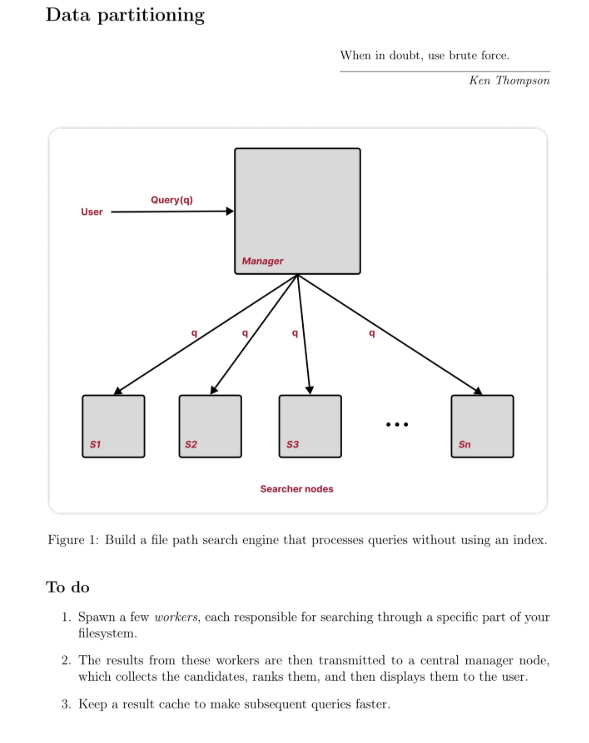

## Overview

This is an assigment for Software Design class where I need to use the brute force approach to search
for something in the file system.

I decided to include this in my git repository because it is an interesting homework based on the approach I
need to take.

## Requirements

